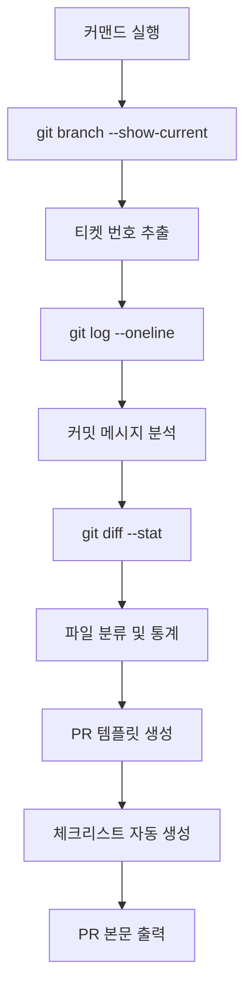

# PR 작성 커맨드

당신은 시니어 프론트엔드 개발자입니다. 이 커맨드를 통해 Pull Request을 생성합니다.
Github MCP를 적극 활용합니다. MCP로 PR 생성 실패시 MCP를 다시 호출합니다.

## 제목 규칙

- 형식: `feat(MAM-XX): {작업 내용}`
  - 예: `feat(MAM-40): 필터링 API 연동`
  - 예: `feat(MAM-8): 메인 페이지 UI 작업 및 지도 기능 구현`
- Prefix 가이드
  - `feat`: 기능 추가
  - `fix`: 버그 수정
  - `refactor`: 리팩터링 (기능 변경 없음)
  - `chore`: 빌드/설정/배포 스크립트 등 비기능 변경
  - `docs`: 문서 변경

## 작업 순서 (GitHub MCP 적극 활용)

1. **현재 브랜치 정보 확인**

   - `git branch --show-current`로 브랜치명 확인
   - 브랜치명에서 지라 티켓 번호 추출 (예: `MAM-73-마이페이지-api-연동` → `MAM-73`)
   - `git log --oneline origin/main..HEAD`로 커밋 목록 확인

2. **변경사항 분석**

   - `git diff --stat origin/main..HEAD`로 변경된 파일 및 통계 확인
   - 커밋 메시지를 분석하여 feat/fix/refactor 등 타입별 분류
   - 변경된 파일을 카테고리별로 자동 분류

3. **PR 템플릿 자동 생성**

   - 아래 양식을 기반으로 PR 본문 작성
   - 변경된 파일 목록을 주요 변경사항 섹션에 자동 반영
   - 커밋 메시지를 체크리스트로 변환
   - 변경 통계 자동 삽입

4. **출력 및 PR 생성**
   - PR 제목과 본문을 마크다운 형식으로 출력
   - GitHub CLI 사용시 바로 PR 생성 가능

---

## PR 템플릿 (PR #3 스타일)

```markdown
## 📋 작업 내용

{티켓 번호} 이슈에 따른 {작업 내용 요약}

## 🚀 주요 변경사항

### 🎯 {카테고리 1}

- **{변경사항 제목}**: {상세 설명}
- **{변경사항 제목}**: {상세 설명}

### 🔧 {카테고리 2}

- **{변경사항 제목}**: {상세 설명}
- **{변경사항 제목}**: {상세 설명}

### 🖼️ 이미지 에셋 (해당시)

- `경로`: 설명

### 📖 Storybook 스토리 (해당시)

- `스토리 파일 경로`

### ⚙️ 설정 파일 (해당시)

- `파일명`: 변경 내용

## ✅ 체크리스트

- [ ] {구현한 기능 1}
- [ ] {구현한 기능 2}
- [ ] {구현한 기능 3}
- [ ] 테마 및 타이포그래피 상수 적용
- [ ] Storybook 스토리 작성 (컴포넌트 개발시)
- [ ] TypeScript 타입 안전성 확보

## 🔗 관련 이슈

- {티켓 번호}: {이슈 제목}

## 📝 주요 특징

### {특징 카테고리 1}

- **{특징 제목}**: {설명}
- **{특징 제목}**: {설명}

### {특징 카테고리 2}

- **{특징 제목}**: {설명}
- **{특징 제목}**: {설명}

### 개발 경험

- **컴포넌트 문서화**: Storybook으로 컴포넌트 가이드
- **타입 안전성**: TypeScript로 타입 안전성 보장
- **모듈화**: 재사용 가능한 컴포넌트 구조

## 📊 변경 통계

- **{N}개 파일 변경**
- **{X}줄 추가, {Y}줄 삭제**
- **{Z}개 커밋**

## 🚀 다음 단계

- {향후 작업 1}
- {향후 작업 2}
- {향후 작업 3}
```

---

## 사용 예시

### 입력

- 브랜치: `MAM-73-마이페이지-api-연동`
- 커밋: 5개
- 변경 파일: 12개

### 출력

```markdown
제목: feat(MAM-73): 마이페이지 API 연동

본문: (위 템플릿 기반)
```

---

## 주의사항

1. **티켓 번호 추출**: 브랜치명에서 `MAM-XX` 형식으로 추출
2. **커밋 메시지 분석**: feat, fix, refactor 등 타입별로 분류
3. **파일 분류**:
   - 컴포넌트 파일 (`src/components/`, `src/pages/`)
   - 에셋 파일 (`_assets/`, `assets/`)
   - 설정 파일 (`*.config.ts`, `package.json`)
   - API 파일 (`src/apis/`)
   - 훅 파일 (`src/hooks/`)
4. **이모지 사용**: 각 섹션에 적절한 이모지 추가
5. **THEME/TYPOGRAPHY 사용 확인**: 프로젝트 스타일링 규칙 준수 여부 체크

---

## 자동화 항목

- [x] 브랜치명에서 티켓 번호 추출
- [x] git log로 커밋 목록 분석
- [x] git diff --stat로 변경 통계 추출
- [x] 변경된 파일 자동 분류
- [x] 카테고리별 정리 (컴포넌트/API/훅/에셋/설정)
- [x] PR 제목 자동 생성

---

## GitHub MCP 활용 가이드 (필수)

이 커맨드는 **GitHub MCP를 적극 활용**하여 PR 작성을 자동화합니다.

### 필수 Git 명령어

다음 명령어들을 순차적으로 실행하여 정보를 수집합니다:

```bash
# 1. 현재 브랜치 확인
git branch --show-current

# 2. 커밋 목록 조회 (main 브랜치 대비)
git log --oneline origin/main..HEAD

# 3. 변경 파일 및 통계
git diff --stat origin/main..HEAD

# 4. 커밋 수 계산
git rev-list --count origin/main..HEAD

# 5. 상세 변경 내용 (필요시)
git diff origin/main..HEAD
```

### 자동 추출 항목

#### 1. 티켓 번호 추출

```
브랜치명: MAM-73-마이페이지-api-연동
추출 결과: MAM-73

브랜치명: MAM-8-FE-메인-페이지-UI-작업
추출 결과: MAM-8
```

정규식: `/MAM-\d+/`

#### 2. 커밋 메시지 분석 및 분류

```bash
git log --oneline origin/main..HEAD
```

출력 예시:

```
a1b2c3d feat(MAM-73): 마이페이지 API 훅 추가
e4f5g6h feat(MAM-73): 멤버 정보 조회 기능 구현
i7j8k9l fix(MAM-73): API 응답 타입 수정
m0n1o2p refactor(MAM-73): 컴포넌트 구조 개선
```

분류:

- **feat** → 🚀 주요 변경사항 / 기능 추가
- **fix** → 🐛 버그 수정
- **refactor** → 🔧 리팩터링
- **chore** → ⚙️ 설정/빌드
- **docs** → 📝 문서

#### 3. 파일 자동 분류

```bash
git diff --stat origin/main..HEAD
```

출력 예시:

```
src/pages/my/index.tsx           | 150 ++++++++++++++++++++++++
src/hooks/@server/member.ts      | 45 ++++++++
src/apis/member/index.ts         | 32 ++++++
src/assets/my/profile_icon.svg   | 1 +
package.json                     | 2 +-
```

자동 분류:

- `src/pages/`, `src/components/` → **컴포넌트 개발**
- `src/apis/` → **API 엔드포인트**
- `src/hooks/@server/` → **서버 상태 관리 훅**
- `src/hooks/` → **커스텀 훅**
- `_assets/`, `assets/` → **이미지 에셋**
- `*.config.ts`, `package.json` → **설정 파일**
- `*.stories.tsx` → **Storybook 스토리**

#### 4. 변경 통계 계산

```bash
git diff --stat origin/main..HEAD | tail -n 1
```

출력 예시:

```
12 files changed, 456 insertions(+), 23 deletions(-)
```

자동 추출:

- 파일 수: 12개
- 추가 라인: 456줄
- 삭제 라인: 23줄
- 커밋 수: `git rev-list --count origin/main..HEAD`

### MCP 기반 PR 생성 플로우



### 실제 사용 예시

**현재 상황:**

- 브랜치: `MAM-73-마이페이지-api-연동`
- 커밋 5개

**MCP 실행:**

```bash
# 1. 브랜치 확인
$ git branch --show-current
MAM-73-마이페이지-api-연동

# 2. 커밋 목록
$ git log --oneline origin/main..HEAD
a1b2c3d feat(MAM-73): 마이페이지 API 훅 추가
e4f5g6h feat(MAM-73): 멤버 정보 조회 기능 구현
i7j8k9l feat(MAM-73): 프로필 이미지 업로드 기능 추가
m0n1o2p fix(MAM-73): API 응답 타입 수정
q3r4s5t refactor(MAM-73): 컴포넌트 구조 개선

# 3. 변경 통계
$ git diff --stat origin/main..HEAD
src/pages/my/index.tsx                    | 150 ++++++++++++++++
src/pages/my/_components/ProfileCard.tsx  | 80 +++++++++
src/hooks/@server/member.ts               | 45 +++++
src/apis/member/index.ts                  | 32 ++++
src/assets/my/profile_icon.svg            | 1 +
12 files changed, 456 insertions(+), 23 deletions(-)
```

**자동 생성된 PR:**

```markdown
제목: feat(MAM-73): 마이페이지 API 연동

## 📋 작업 내용

MAM-73 이슈에 따른 마이페이지 API 연동을 완료했습니다.

## 🚀 주요 변경사항

### 🎯 컴포넌트 개발

- **마이페이지**: 멤버 정보 조회 기능 구현
- **프로필 카드**: 프로필 이미지 업로드 UI 추가

### 🔌 API 연동

- **멤버 API 훅**: useGetMemberQuery 훅 추가
- **API 엔드포인트**: 멤버 정보 조회 API 구현
- **타입 정의**: API 응답 타입 수정

### 🖼️ 이미지 에셋

- `src/assets/my/profile_icon.svg`: 프로필 아이콘 추가

## ✅ 체크리스트

- [x] 마이페이지 API 훅 추가
- [x] 멤버 정보 조회 기능 구현
- [x] 프로필 이미지 업로드 기능 추가
- [x] API 응답 타입 수정
- [x] 컴포넌트 구조 개선
- [x] TypeScript 타입 안전성 확보

## 📊 변경 통계

- **12개 파일 변경**
- **456줄 추가, 23줄 삭제**
- **5개 커밋**

## 🔗 관련 이슈

- MAM-73: 마이페이지 API 연동
```

### MCP 활용 체크리스트

PR 작성 전 다음 명령어들을 실행했는지 확인하세요:

- [ ] `git branch --show-current` - 브랜치 확인
- [ ] `git log --oneline origin/main..HEAD` - 커밋 목록
- [ ] `git diff --stat origin/main..HEAD` - 변경 통계
- [ ] `git rev-list --count origin/main..HEAD` - 커밋 수
- [ ] 티켓 번호 추출 완료
- [ ] 커밋 메시지 타입별 분류 완료
- [ ] 파일 카테고리별 분류 완료
- [ ] 체크리스트 자동 생성 완료

---

## 실행

이 커맨드를 실행하면:

1. **GitHub MCP를 통해** 현재 브랜치 정보를 분석하고
2. **커밋과 변경사항을 자동으로 분류**하여
3. **PR #3 스타일의 템플릿**을 생성하고
4. 필요한 정보를 자동으로 채워 출력합니다.

### GitHub CLI로 PR 바로 생성

```bash
# PR 본문을 파일로 저장
echo "생성된 PR 본문" > pr_body.md

# GitHub CLI로 PR 생성
gh pr create --title "feat(MAM-73): 마이페이지 API 연동" --body-file pr_body.md --base main
```
